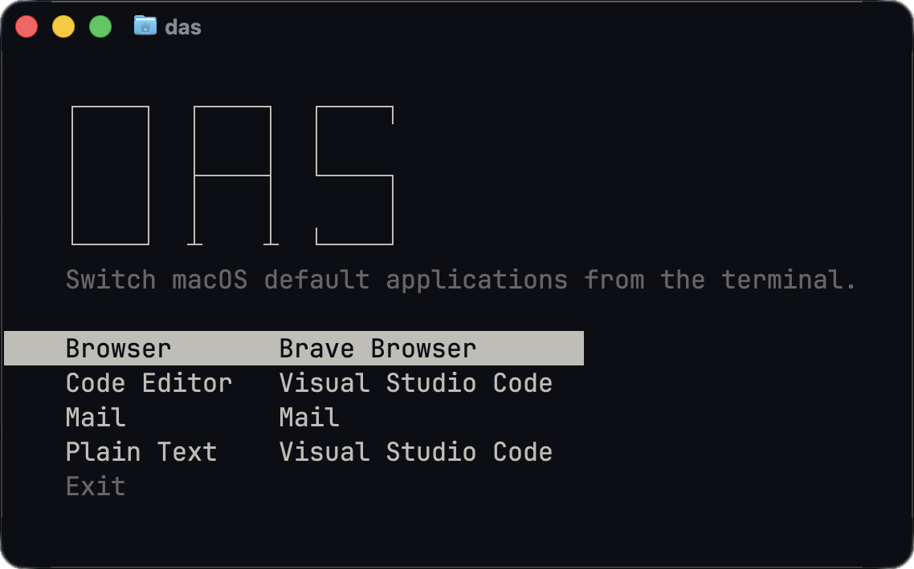

# Default App Switcher

Switch macOS default applications from the terminal.

## Preview



## Installation

Run this command in your terminal and open a new terminal after installation.

```bash
curl -fsSL https://raw.githubusercontent.com/ivemadestuff/default-app-switcher/master/scripts/install.sh | bash
```

Requires `macOS` and `Xcode Command Line Tools` with `Swift 6` or later.

If the tools are missing, run `xcode-select --install` first.

### Update

Run the [installation command](#installation) again to update to the latest release.

### Uninstall

```bash
curl -fsSL https://raw.githubusercontent.com/ivemadestuff/default-app-switcher/master/scripts/install.sh | bash -s -- --uninstall
```

This removes the installed files and command link; your default apps and shell configuration are preserved.

## Usage

Run `das` in an interactive terminal to choose an app. 

Use `das --help` for help or `das --version` to show the version.
